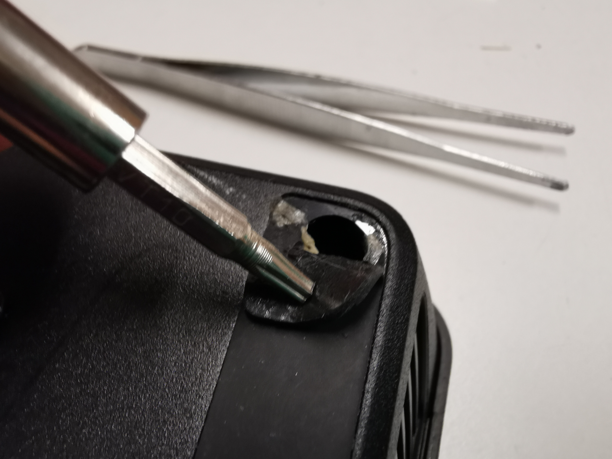
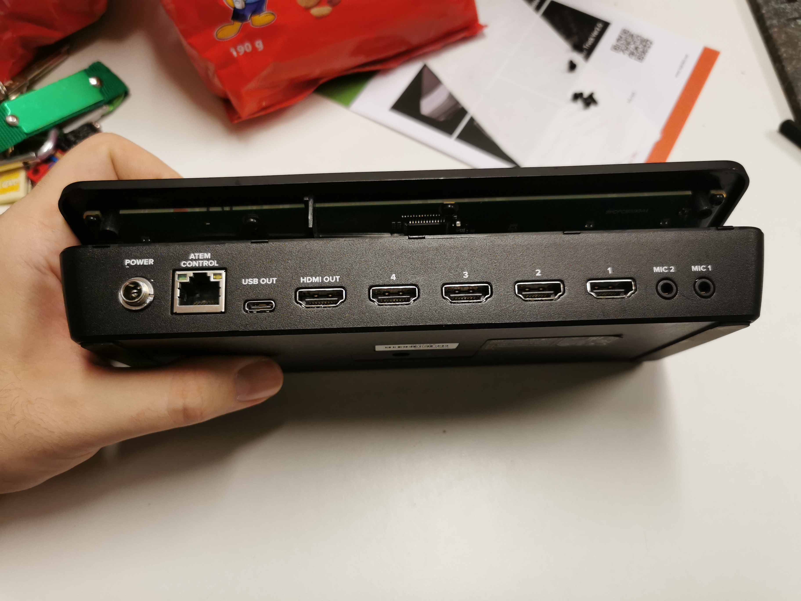
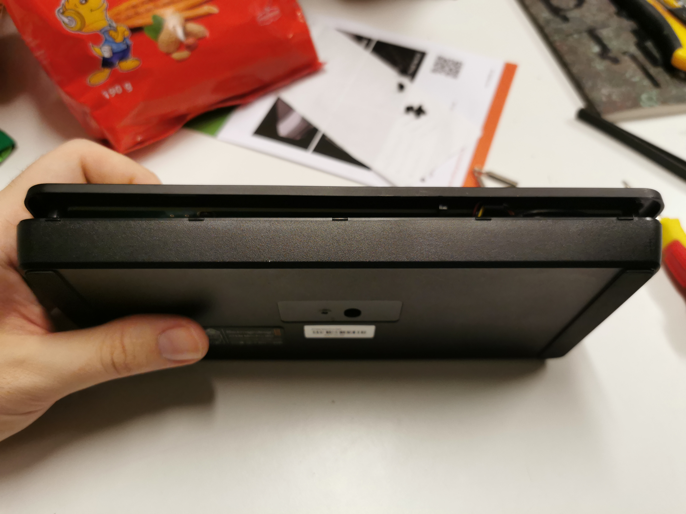
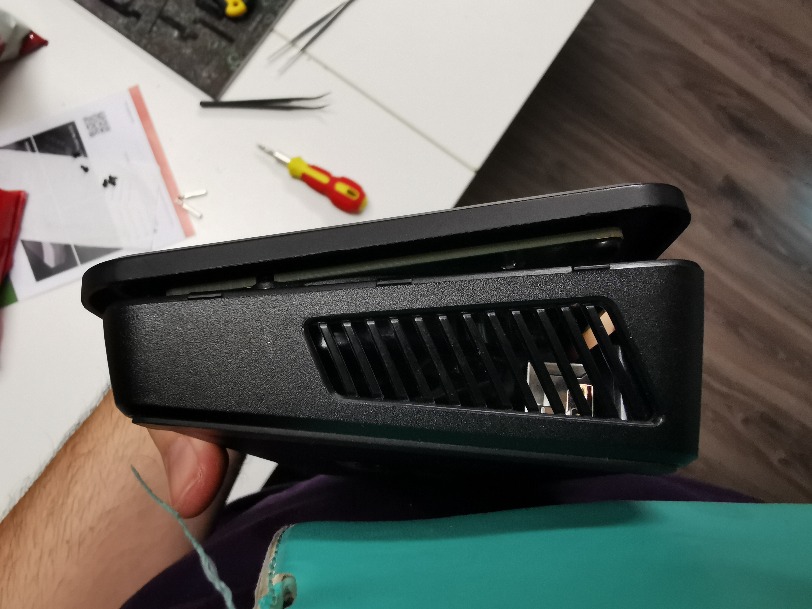
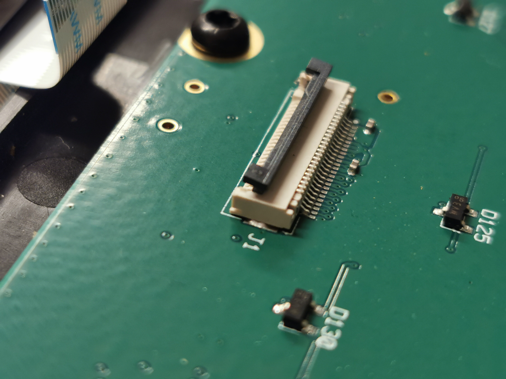
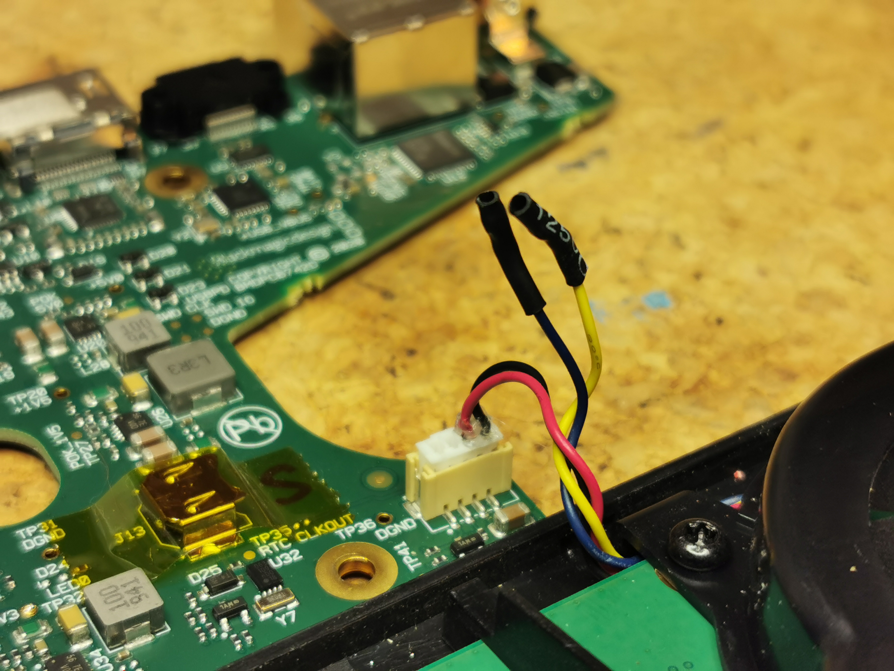

# ATEM Mini fan mod
Easy hack for ATEM Mini and ATEM Mini Extreme switchers to make the fan always run at max speed to prevent overheating.

All you need to do is remove the blue and the yellow wire from the fan connector.

Be aware that this might void your warranty, but if you're careful enough I think it's possible to remove the label and the rubber pads without any damage. Of course, if you're gonna claim your warranty, you should reverse the mod.

## Tools

You need a T10 torx screwdriver.

## Instructions

1. Remove the 4 screws that are located under the rubber pads, in the corners.

2. Remove the center screw under the black label that says "Blackmagicdesign". (The Extreme model doesn't have the screw under the label).

3. Carefully release the case clips by sliding a guitar pick along the edge.

4. Carefully open the case, from the taller (thicker) side. There is a flex cable on the thinner side. (In case the flex cable slips out, the connector opens by pulling upwards on the black thingy - see photos. It should open like a door. Slide the cable back in and close the door.)

5. Unplug the fan cable.

6. Cut the blue wire or if you don't want to cut it, remove the pins from the connector by lifting the tiny plastic tongue on the connector and pull the wire out. (Search how to remove inserts from XH connector.)
The blue wire is the PWM control. The yellow wire is the tachometer signal (it tells the processor if the fan is running at the correct speed). By disconnecting the PWM, the fan runs at full speed by default.

7. Isolate the wire with heatshrink or tape.

8. Plug the cable back in, make sure it's rotated correctly and don't force anything. Also plug the flex cable back in if you unplugged it earlier.

9. Put everything back together.

You should now hear the fan run at maximum speed! It's not even loud and it will make your ATEM Mini less prone to overheating and make it last longer.

## Photos

